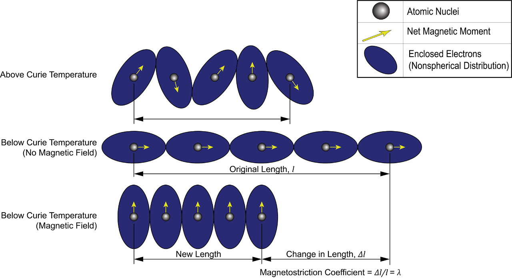
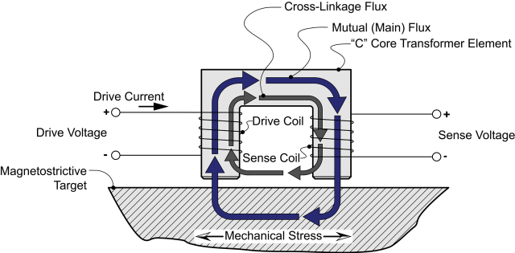
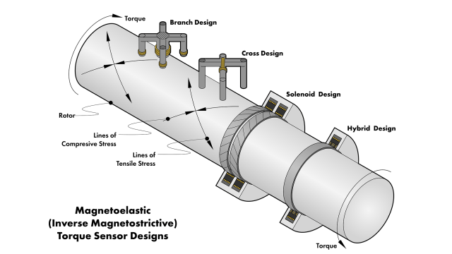

# MagnetoelasticSensor

Python libraries used to model magnetoelastic (inverse magnetostrictive) sensors.

# Get Started!

You already know about these sensors and want to get the code? Here’s an index and sample programs to get you started:

- [HelloWorld.ipynb](https://github.com/MoreCoffee12/MagnetoelasticSensor/blob/main/notebooks/HelloWorld.ipynb) – Excercises all the functions and estimates sensor response over gap and torque.

# What is a magnetoelastic sensor?

The magnetic properties of ferromagnetic materials change under stress. A magnetoelastic sensor measures these changes in stress. This Readme.md has a summary of the sensors. For more details, check out the companion website and page at [robotsquirrelproductions.com](https://robotsquirrelproductions.com/vibration-transducers/#section-13).

#### Magnetostriction

Magnetostriction describes a ferromagnetic material’s response to a magnetic field. These materials change shape in the presence of a field. The figure hows the mechanism behind magnetostriction. The top row shows the magnetic domains above the Curie temperature. In this state, the domain orientation varies. When the environmental temperature falls below the Curie temperature, applying a strong magnetic field rotates the spins and the electron clouds to a new orientation.

Line drawing showing a sketch of magnetostrictive mechanism. (original vector image from [Adobe Stock](https://stock.adobe.com/) File ID: [898634968](https://stock.adobe.com/stock-photo/id/898634968)).

As shown in the figure above, under some conditions, the magnetic moments align across many atoms. Metallurgists and physicists use the term “domain” to describe regions within steel crystals where the magnetic moments of atoms align. These domains have dimensions much smaller than the typical crystal structure of most ferrous materials.

## Principles of operation

Stress can also cause changes in spin and electron cloud orientation in ferromagnetic materials. These shifts change how magnetic fields pass through the material. A magnetoelastic sensor passes a magnetic field through a target to determine the stress state. The figure below shows a schematic for a single-branch magnetoelastic sensor.

Line drawing showing a simplified sketch of a magnetostrictive single branch sensor system with magnetic flux paths. (original vector image from [Adobe Stock](https://stock.adobe.com/) File ID: [89897389708](https://stock.adobe.com/stock-photo/id/897389708)).

The sensor acts like a transformer, with a drive coil and a sensing coil coupling, at least in part, through a ferrite core. The target (typically a turbomachinery rotor) provides part of the magnetic circuit. Mechanical stress alters the crystal lattice spacing, thereby affecting the magnetic permeability of the target material. Tensile stress increases permeability because of better domain alignment; compressive stress decreases permeability. These changes affect the sensing coil’s voltage output.

**Configurations**

Inverse magnetostrictive sensor architectures for measuring torsional strain fall into four categories, shown in the figure below. In this figure, each sensor observes the same shaft experiencing a state of pure torque.

Line drawing showing a sketch of magnetostrictive mechanism. (original vector image from [Adobe Stock](https://stock.adobe.com/) File ID: [1889319905](https://stock.adobe.com/stock-photo/id/1889319905))
